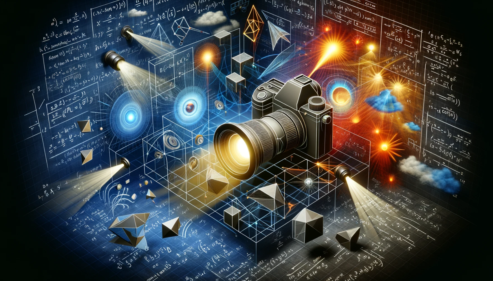
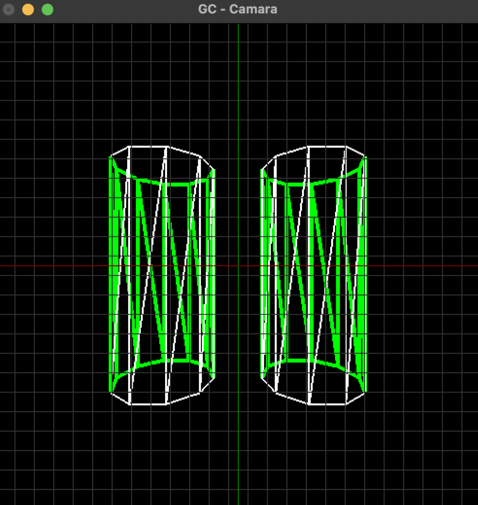

# Gráficos por Computador - Cámara 🎥

---
## **Introducción**
Este proyecto, utilizando **OpenGL**, es una aplicación que se sumerge en las *técnicas de cámara e iluminación* en gráficos por computador. Más que en el uso de OpenGL, se centra en las matemáticas subyacentes. 

Presenta dos versiones principales: **Cámara** e **Iluminación**, cada una con características únicas e ilustradas a través de videos cortos.

  

---

## **Características**

### **Versión de Cámara**
- **Configuración Inicial**: Visualiza cilindros y mallas estructuradas alrededor de los ejes globales para una **experimentación intuitiva**.
- **Transformaciones de Objetos**: Ofrece soporte para *rotación*, *traslación* y *escalado*, aplicables de manera global o local.
- **Mecánicas de Cámara**: Profundiza en las *matrices de cámara*, el *pipeline de visualización* (modelado, vista, proyección) y los modos de cámara (*vuelo* y *análisis/órbita*).
- **Algoritmos de Optimización**: Introduce técnicas como *back culling* y *clipping* para mejorar el rendimiento.

### **Versión de Iluminación**
- **Estructura Mejorada**: Avanza hacia una estructura de datos de objetos más compleja, con objeto de soportar técnicas de iluminación avanzadas.
- **Tipos de Iluminación**: Expone la diversidad de las fuentes de luz, incluyendo *luz direccional* (sol), *posicional* (bombilla) y *focos*, tanto para objetos como para la cámara.
- **Modo de Sombreado**: Se implementa Flat y Goraud shading y dejando soporte para futuras implementaciones extra.

---

## **Videos de Demostración**
Se pueden ver unos videos de demostración, tanto d ela versión de cámara cómo de iluminación en la siguiente lista de reproducción:

  

---
